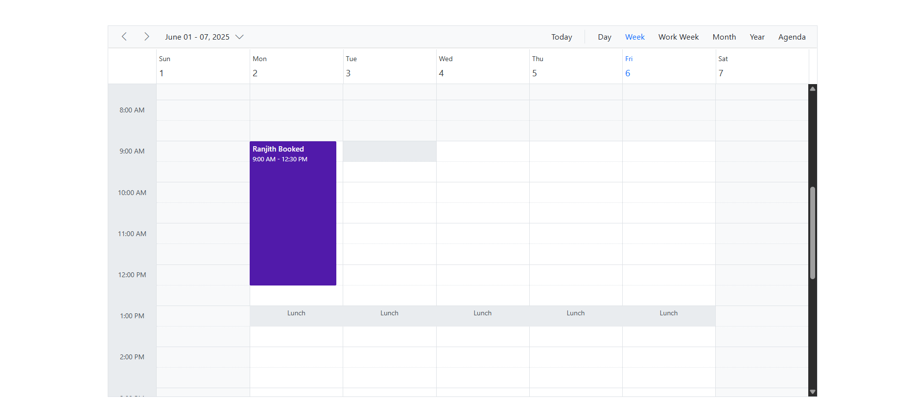
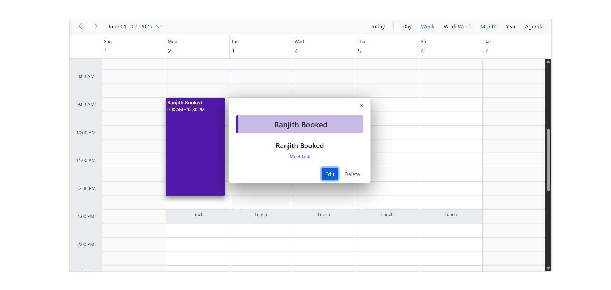
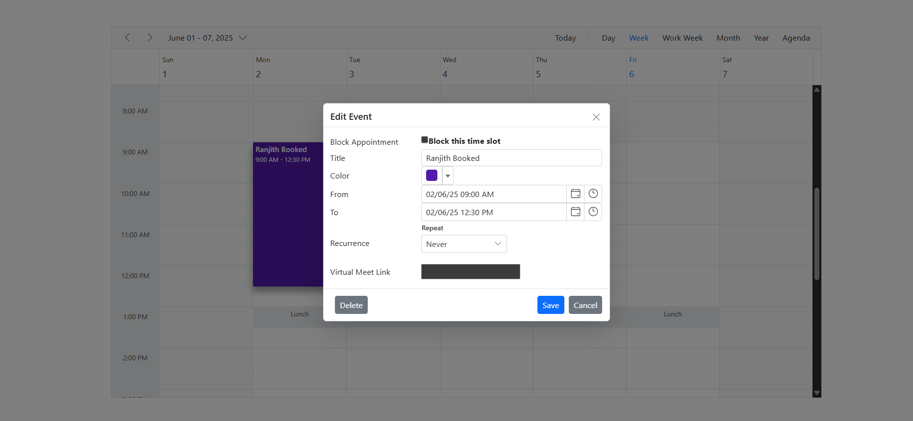
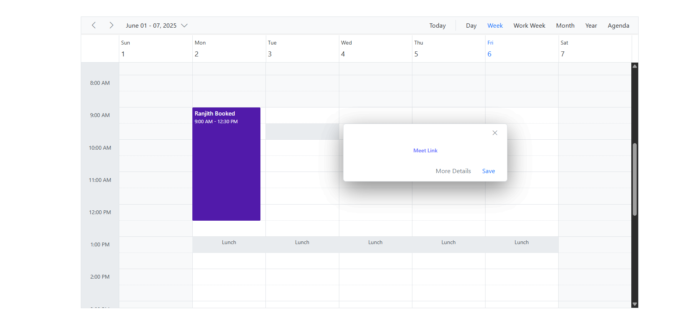
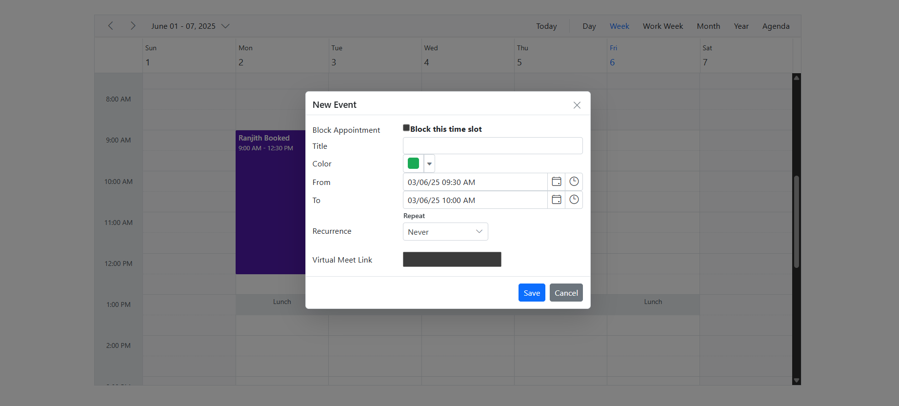

# Scheduler Unavailable

A calendar-based scheduling application that allows users to create, edit, delete, and color-code events. Events can be dragged and dropped to reschedule easily.

---

## 🚀 Getting Started

### 1. Install Dependencies

Install the required dependencies for both the **backend** and **frontend**:

```bash
npm install
```

Make sure to run this command in both the backend and frontend directories (where the `package.json` files are located).

### 2. Run the Application

Start the **backend** server:

```bash
node server.js
```

Start the **frontend** development server:

```bash
npm run dev
```

### 3. Open in Browser

Navigate to:

```
http://localhost:5173
```

---

## 🖼️ Screenshots

### 📆 Main Calendar View



### ➕ Booked Event Clicked



### ✅ Edit Event



### ➕ New Event



### ✅ Add Event



---

## ✨ Features

* 📅 **Book Events:** Click a date to add a new event.
* ✏️ **Edit Events:** Click an existing event to update its details.
* ❌ **Delete Events:** Easily remove any event you’ve created.
* 🎨 **Color Picker:** Assign custom colors to events.
* 📦 **Drag & Drop:** Move events to different dates intuitively.

---

## 🛠️ Tech Stack

* **Frontend:** React
* **Backend:** Node.js

---

## 📬 Feedback

Have suggestions or found bugs? Feel free to open an issue or contribute!

---